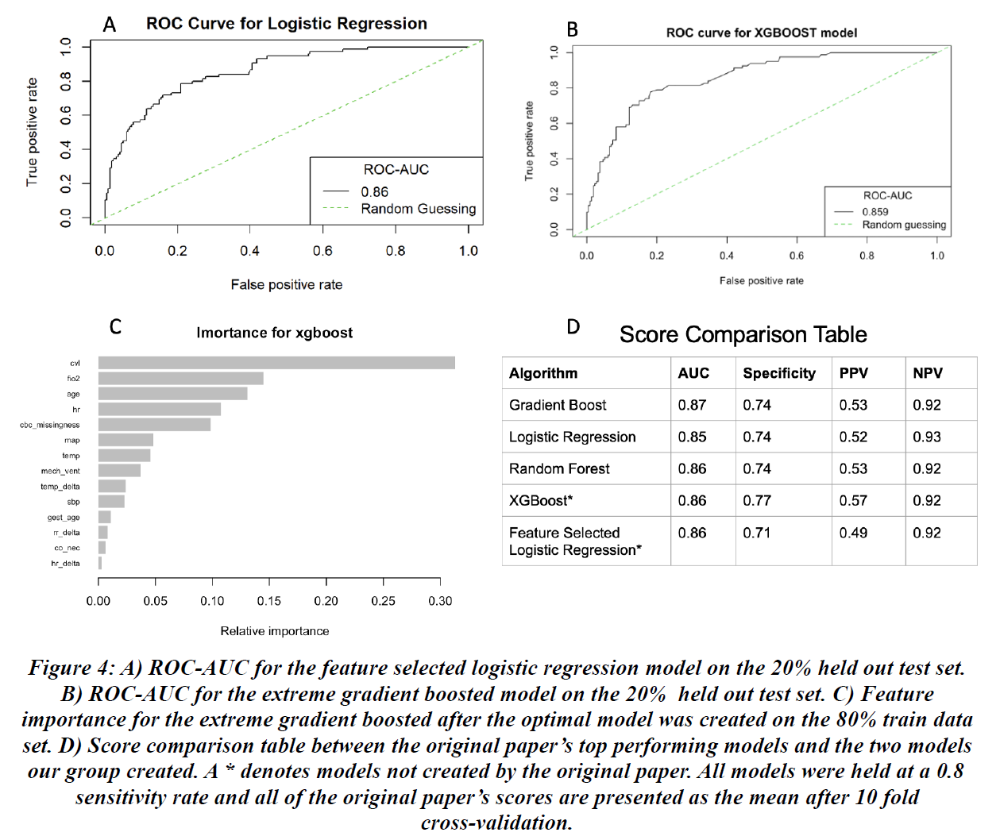

[](https://github.com/braden2447/BME-580-Project/blob/main/LICENSE.txt)

# BME 580 Final Project

## Authors: Braden Garrison, Denver Bradley, and Venkat Battepati

## Due: 4/12/22

## Abstract

Sepsis is a body’s extreme response to an infection that can lead to tissue damage, organ
failure, and other life-threatening complications. Early sepsis detection is critical to successful
treatment, especially in pediatric patients, but sepsis can be difficult to diagnose due to
variability in septic symptoms and biomarkers (Center for Disease, 2021). Developing novel
ways to identify pediatric sepsis has become critical for improving patient care and sepsis
outcomes. Here we extend upon the work of Masino (Masino et al, 2019) by using
easily-accessible electronic health record (EHR) data to develop two pediatric sepsis prediction
models. Our feature selected logistic regression model was comparable to the Masino models,
scoring a 0.86 area under the receiver operating characteristic (ROC-AUC) curve and a
specificity and positive predictive value (PPV) of 0.71 and 0.49, respectively. Our extreme
gradient boosting model improved upon the Masino models, scoring a ROC-AUC, specificity,
and PPV of 0.86, 0.77, and 0.57, respectively, proving further investigation of EHR sepsis
prediction models appropriate.

## Exploratory Data Analysis and Pre-Processing

Data was obtained from infants who had been hospitalized for a minimum of 48 hours in the neonatal 
intensive care unit of the Children's Hospital of Philadelphia from September 2014 - November 2017. 
The data was openly available to download from the referenced online research article (Masino et al, 2019). 
The datasets contained 38 columns of both numerical and categorical data, including factors such as 
gestational age, creatinine levels, WBC count, apnea diagnosis, perfusion diagnosis, and central venous line 
use. A high level of missingness (54-94%) was seen for some numeric variables. Further dataset information and 
EDA visualizations can be found in ```Exploratory Data Analysis.rmd```.

Two missingness variables were created to account for the high level of missingness. The variables wbc, 
hgb, it_ratio, and platelet_count were removed and replaced with a feature called cbc_missingness (complete 
blood count panel). The variables bicarb, glucose, and creatinine were removed and replaced with a feature 
called blood_chem_missingness (blood chemistry panel). The decision to replace these variables was justified 
by quantifying the correlation of missingness between the two groups in the EDA file. The variable capPH was 
completely removed from the dataset due to a missingness of 94%. All other missing values were mean imputed.

## Core Methods

Two supervised learning models were used for the classification task of determining whether patients were sepsis 
positive or sepsis negative. The methods used were a feature selected logistic regression (FSLR) model and an 
extreme gradient boosting (XGBoost) model. For both supervised methods, the models were trained on 80% of the 
dataset and tested on the left-out 20%. For both models, high scores in ROC-AUC, sensitivity, and specificity were 
desired, as high scores in these metrics indicate that the model is good at predicting true positive and true 
negative values. Positive values in this study indicate sepsis positive infants, and predicting sepsis correctly 
is advantageous as it can quickly become deadly in newborn children. FSLR and XGBoost models and parameters can be found in 
```Feature_Selected_Log_Reg.rmd``` and ```Extreme-Gradient-Boost.Rmd```, respectively.

## Feature Selected Linear Regression Model

The FSLR model differs from the Masino logistic regression model because it only uses uses a selected 13 features out of the 30
available features from the data set. These features were selected based on their importance to
the first three components of the PCA and MCA. The first two most important features were
chosen within each principal component analyzed. The Central Venous Line feature was also
added from the first component of the MCA, as its importance was also high. The first three
components for the PCA and MCA were used since they each had an eigenvalue greater than 2.
The thirteen features selected were uac, ecmo, lethargy, fio2_threshold, sbp, map, gest_age,
weight, hr_delta, rr_delta, cvl, hr, age, and temp. A logistic regression model was chosen
because logistic regression is useful in binary classification problems like the one we are
analyzing. 

Additionally, the logistic regression approach achieved some of the highest ROC-AUC
and specificity scores within the original paper. This study wanted to examine if a logistic
regression with a limited amount of features could achieve high scores or a better performance.
An attempt at a model with less features was done because less features that are needed for a
model reduces testing time and discomfort for the infants due to the reduction of tests that need
to be completed. The data used for this method was centered and scaled.

## Extreme Gradient Boosting Model

The XGBoost model was chosen because similar boosting techniques all achieved high
ROC-AUC and specificity scores in the original paper. Additionally, extreme boosting works
well with non-linear data and data with a mix of numerical and categorical variables. XGBoost
also allows for examination of feature importance. XGBoost was shown to be a feasible
approach for medical diagnoses as it performed well in diagnosing Parkinson disease in the past
(Karabayir, Ibrahim, et al., 2020). The XGBoost method improves upon stochastic gradient
boosting, the method used by the original paper, by utilizing the second derivative of the gradient
to determine the direction the model should descend the gradient.

In addition, XGBoost uses L1 and L2 regularization to make models more generalizable.
The optimal parameters for the XGBoost model were discovered by using a 5 fold
cross-validation grid search on the train set. The grid search looked to find the best combination
of nrounds at 5, 10, 15, and 20; max depth at 3, 6, 10, and 15; and eta at 0.1, 0.2, 0.3, and 0.5.
The nrounds range was set between 5 and 20 because this range saw minimum test error in
previous testing. The grid search chose the best parameters that maximized sensitivity, as
positive case recognition was most important to this study. The parameters chosen were nrounds
= 15 , max depth = 15, and eta = 0.1.

## Results



The FSLR model achieved a ROC-AUC of 0.86 (Figure 4A) . The XGBoost model
achieved a ROC-AUC of 0.859 (Figure 4B). Both of these scores are high performing scores
and indicate the two models are good at detecting positive sepsis cases. The XGBoost model
determined Central Venous Line, FiO2, age, heart rate, and cbc_missingness to be the five most
important features to the model (Figure 4C). This aligns with the PCA and MCA conducted as
FiO2, age, and heart rate were all determined to be important by those methods as well. The
inclusion of this study’s generated cbc_missingness variable shows that needing to conduct a
complete blood count test on an infant is a useful indicator for sepsis prediction.

Both the FSLR and XGBoost model had comparable scores to the highest performing
models tested by the original paper, which reported the mean scores after 10 fold cross-validation
(Figure 4D). To compare scores, the sensitivity of all models were held at a constant 0.8. AUC,
Specificity, Negative Predictive Value (NPV), specificity, and PPV were examined because that
is what the original paper used in their metrics and because they are also good indicators on how 
models predict the true positive and true negative classes. The original paper’s gradient boosted
model had a higher AUC than both of this study’s models. The original paper’s logistic
regression model had a lower AUC than both of this study’s models, but it was the only model to
achieve a NPV of 0.93 while all other models had an NPV of 0.92. The XGBoost had the highest
specificity and PPV out of all models tested. This indicates that the XGBoost model is more
useful at reducing the number of false positive cases, which may be helpful in this scenario as
some sepsis testing on infants can be invasive and should be avoided if not needed. The FSLR
model had the lowest specificity and PPV of the models examined. However, the FSLR model
still achieved high scores while only utilizing 13 features. Having a smaller set of features and
achieving high scores is impressive because models that need less features will need less testing
to be done, which can reduce cost, time, and discomfort for patients.

## Conclusions and Future Work

Our study was able to create an XGBoost model that performed better than the top
performing models of the original paper and a FSLR model that was able to achieve similar
scores to the same top models. In the future, it would be beneficial to see if the scores achieved
by the FSLR and XGBoost models are statistically significant compared to the original papers.
This could be done by utilizing the same 10 fold cross validation done within the original paper
on this study’s models and performing a Student’s t-test to see if the scores achieved are
significant.

One of the largest problems of this dataset was the large amount of missing data points
present. To overcome this challenge, this study utilized two separate missingness categories and
removed the high missingness variable capPH. This made the dataset easier to work with and
could be a reason why the XGBoost model performed so well when compared to the original
paper’s models, as one created missingness variable was an important feature to the XGBoost
model. Other imputation methods could also be explored besides mean imputation, such as
multiple imputation, to produce better training and test data sets for future models.

The results seen by the XGBoost model are promising and could lead to future
developments of other boosted models that could achieve similar high scores such as light
gradient boosted models and CatBoosted models. Since the FSLR model performed well, future
developments to the feature selection process could be made to see if other combinations of
features can perform well or if fewer features could also perform well. Overall, the models of
this study proved to be comparable, and even better in the case of the XGBoost, when weighed
against the Masino models. These results support the claim made in Masino et al. that machine
learning models can predict pediatric sepsis using values routinely collected in most EHRs.
However, further research involving larger datasets and more rigorous training methodologies is
needed to improve these models to a level of confidence necessary for clinical decisions.